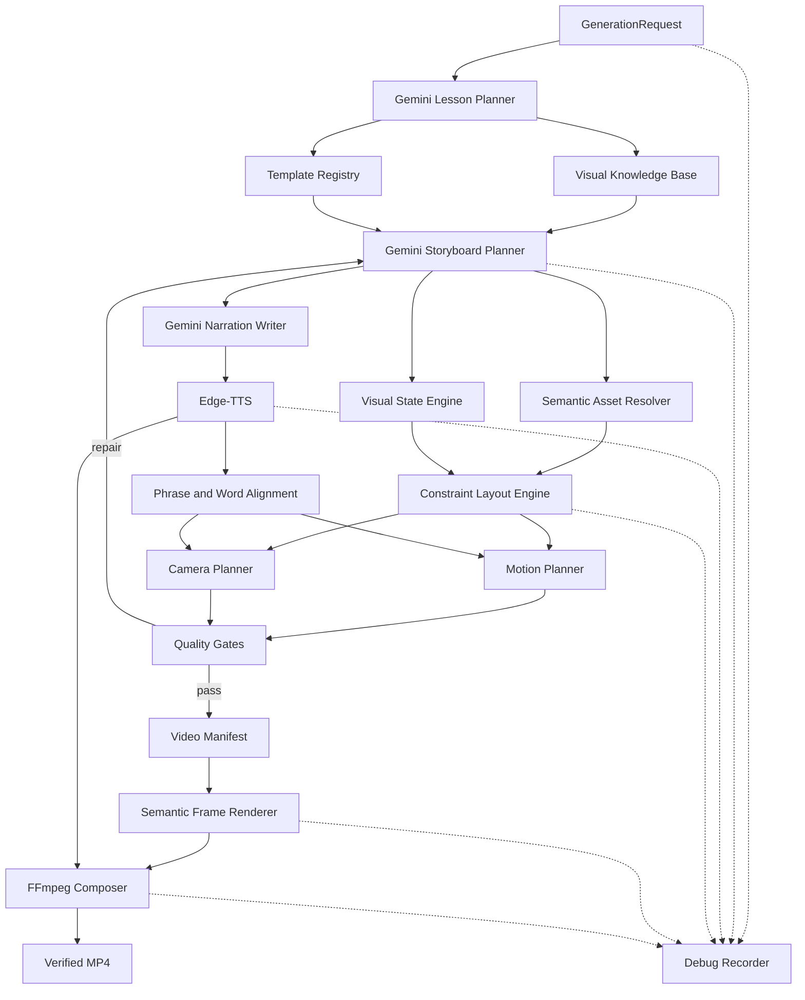

# Whiteboard AI Video Generator — Complete Project Handoff

This document is for a developer opening the project for the first time. It explains why the project exists, how it evolved, what currently works, where the important code lives, how a video is produced, how to debug it, what is still weak, and how to publish and contribute safely.

Last verified: July 28, 2026  
Python: 3.12  
Default pipeline: V2  
Automated test status at handoff: 92 passed

## 1. Read this first

The project generates an educational whiteboard-style MP4 from a text topic.

Example:

```text
Topic: Explain the encoder-decoder concept
        ↓
Lesson and concept graph
        ↓
Visual storyboard and narration
        ↓
TTS audio and timing
        ↓
Semantic layout, motion, and camera plans
        ↓
PNG frames
        ↓
FFmpeg combines frames and narration
        ↓
outputs/final_video.mp4
```

The project has two pipelines:

- **V1** is the original rule-based pipeline. It remains available for compatibility.
- **V2** is the current default. It uses a semantic storyboard, persistent visual objects, typed operations, constraint-based layout, quality gates, and a dedicated renderer.

V2 is architecturally stronger, but the visual output is not yet production quality. The most important next work is described in [Current limitations and next roadmap](#14-current-limitations-and-next-roadmap).

## 2. Product goal

The intended product should:

1. Accept a topic and target audience.
2. Decide what must be taught and in which order.
3. Create a visual explanation rather than a slideshow of text.
4. Generate natural narration.
5. Synchronize meaningful visual actions with narration.
6. Produce a clear whiteboard-style video with correct diagrams.
7. Preserve enough debug information to explain every decision.
8. Reject or repair visually broken output before composition.

The system deliberately separates AI decisions from deterministic execution:

- Gemini decides educational meaning, concepts, narration, and semantic storyboard intent.
- Python services validate models, resolve assets, solve geometry, schedule motion, render pixels, and compose media.
- Gemini is not allowed to emit raw pixel coordinates.
- The renderer is not supposed to invent educational meaning.

## 3. How the project evolved

The project was built incrementally. Understanding this history explains why V1 and V2 coexist.

### Phase 1: Foundation

The first work created:

- Python 3.12 project structure
- Environment-backed settings
- Loguru console and file logging
- Pydantic v2 base models
- Gemini client
- Tests and basic documentation

No video logic existed at this point.

### Phase 2: Original V1 pipeline

The original implementation added:

- Gemini script generation
- Script, scene, visual-instruction, rendering, animation, audio, and manifest models
- Asset planning and local icon detection
- SVG generation for arrows, circles, and boxes
- Scene graph building
- Static Pillow rendering
- Animation timelines
- Per-frame PNG generation
- Edge-TTS narration
- FFmpeg MP4 composition
- End-to-end `PipelineRunner`

V1 successfully produced audio and video, but its visuals were predominantly rule-based boxes, circles, and arrows.

### Phase 3: Media synchronization and debugging

Several practical problems were discovered:

- Narration was correct, but audio and video were initially not merged reliably.
- Frames did not correspond well to the narration.
- Image placeholders appeared instead of useful visuals.
- It was difficult to tell what Gemini received, what Gemini returned, what TTS received, and how each frame was generated.

The project added a structured debug recorder. A real run now records:

- LLM inputs and validated outputs
- TTS input and audio metadata
- Storyboard, narration, assets, layout, motion, camera, and manifest artifacts
- Frame-by-frame traces
- FFmpeg command construction
- Verified audio/video stream information
- Errors and per-stage execution timings

This was an important turning point because problems could be traced to a specific stage instead of guessed from the final MP4.

### Phase 4: V2 semantic redesign

Debug evidence showed that improving a few drawing rules would not be enough. V2 was introduced as a semantic video compiler.

V2 added:

- Generation requests and audience profiles
- Lesson plans and concept graphs
- Visual strategies and template matching
- Persistent semantic storyboard objects
- Typed visual operations
- Immutable visual states
- Semantic asset resolution
- Hierarchical constraint layout
- Semantic motion planning
- Attention planning
- Virtual camera planning
- Phrase-addressable narration
- Deterministic and optional multimodal quality evaluation
- Versioned JSON schemas
- V1/V2 compatibility adapters

### Phase 5: Reliability, timeout, and speed work

Real Gemini calls sometimes needed much longer than expected. API timeouts became configurable and can be disabled with:

```dotenv
GEMINI_TIMEOUT_SECONDS=none
```

Frame rendering was optimized through:

- Cached object layers
- Reuse of identical frames
- Parallel PNG writes
- Batched frame tracing
- Reduced repeated Pillow allocations

The renderer became much faster than its initial implementation, although MP4 composition and thousands of PNG files are still expensive.

### Phase 6: Layout and visual cleanup

Real videos exposed cropped labels, overlapping objects, tangled connectors, and unreadable final diagrams.

The renderer was improved with:

- Active-context framing
- Adaptive text fitting and wrapping
- Container headers
- Compact packing of connected groups
- Boundary-attached connectors
- Orthogonal obstacle-aware arrow routing
- Explicit render ordering
- Native-resolution view fitting

These changes removed many severe overlaps, but they did not make the underlying visuals sufficiently expressive.

### Phase 7: Current visual-quality enhancements

The latest changes added:

- Shared whiteboard design tokens
- Teaching-beat purposes
- Additional educational templates
- Concept-specific SVG line-art generation
- Edge-TTS word-boundary models
- Purpose-aware motion and camera planning
- Progressive connector-path drawing
- Geometry-aware visual preflight
- Educational-quality scoring
- Expanded regression tests

Some of these features are present in the architecture but are not yet active enough in real output. For example, the latest real run produced zero word timings, matched templates without directly instantiating them, used no semantic illustrations, and allowed every camera cue to remain `fit`.

## 4. Current feature inventory

### Planning and AI

- Gemini 2.5 Flash client
- Typed structured generation with bounded retries
- Lesson planning
- Concept graph generation
- Storyboard planning
- Narration writing
- Storyboard repair interface
- Optional Gemini Vision frame evaluation

### Semantic visual system

- Stable object IDs
- Persistent object state across beats
- Create, update, move, resize, highlight, dim, erase, connect, duplicate, group, and related operations
- Layout constraints without LLM-provided pixels
- Semantic style tokens
- Attention cues
- Camera intents
- Reusable template registry
- Local/generated editable SVG assets

### Rendering and animation

- 1920×1080 Pillow rendering by default
- Text wrapping and fitting
- SVG and raster asset rendering
- Routed connectors and arrowheads
- Progressive reveals
- Fade, growth, highlight, erasure, and motion strategies
- Camera fit, pan, focus, track, zoom, and hold contracts
- Continuous numbered PNG frames

### Audio and composition

- Edge-TTS narration
- One measured audio segment per narration phrase
- MP3 metadata inspection
- Phrase-level alignment
- Word-timing contracts and capture path
- Continuous video manifest
- FFmpeg H.264/AAC composition
- FFprobe-style output verification through the composer

### Quality and observability

- Semantic concept coverage
- Asset readiness checks
- Layout diagnostics
- Readability and visual-density checks
- Motion/static-gap checks
- Educational progression checks
- Pixel-geometry preflight contracts
- Optional multimodal evaluation
- Complete debug run bundles
- Stage timing measurements
- Content-addressed checkpoints

## 5. Architecture



### Important architectural rule

Do not collapse all stages into one large Gemini prompt.

The value of the architecture is that every stage produces a validated artifact that can be inspected, tested, cached, repaired, or replaced independently.

## 6. V2 pipeline execution order

The production orchestrator is `app/application/orchestrators/pipeline_v2.py`.

| Order | Stage | Important output |
|---:|---|---|
| 1 | Plan Lesson | `LessonPlan` and `ConceptGraph` |
| 2 | Select Visual Strategies | Ranked visual teaching approaches |
| 3 | Match Templates | Ranked `TemplateMatch` records |
| 4 | Plan Storyboard | Persistent semantic `Storyboard` |
| 5 | Plan Attention | Highlight/focus cues |
| 6 | Evaluate Storyboard | Structured `QualityReport` |
| 7 | Write Narration | Beat-linked `NarrationPlan` |
| 8 | Generate Narration | MP3 and measured `AudioMetadata` |
| 9 | Align Phrases | `AlignedAudio` |
| 10 | Resolve Assets | `ResolvedAssetSet` |
| 11 | Build Persistent States | `VisualDocument` |
| 12 | Solve Layout | `LayoutPlan` |
| 13 | Plan Motion | `MotionPlan` |
| 14 | Plan Camera | `CameraPlan` |
| 15 | Evaluate Compiled Plan | Combined quality report |
| 16 | Build Manifest | Frame/audio boundaries |
| 17 | Render Frames | Numbered PNG sequence |
| 18 | Optionally Evaluate Frames | Multimodal quality report |
| 19 | Compose Video | H.264/AAC MP4 |
| 20 | Verify and Record | Result and debug artifacts |

If a stage raises an exception, the pipeline stops and preserves the original exception. Quality repair is bounded by `V2_MAX_REPAIR_ATTEMPTS`.

## 7. Important data contracts

The most important models are under `app/domain/`.

### `GenerationRequest`

Defines topic, target duration, audience, voice, style, output resolution, FPS, and run ID.

### `ConceptGraph`

Contains:

- Learning objectives
- Concepts and definitions
- Importance scores
- Prerequisites
- Directed semantic relationships
- Teaching order
- Visual affordances

### `Storyboard`

Contains ordered `VisualBeat` records. Each beat declares:

- Concepts being taught
- Teaching intent
- Narration intent
- Purpose such as `introduce`, `demonstrate`, `compare`, `transform`, `connect`, `emphasize`, or `summarize`
- Semantic visual operations
- Attention cues
- Camera intent

### `VisualObjectSpec`

Describes a visual object before geometry exists:

- Stable object ID
- Semantic kind and role
- Concept IDs
- Content
- Style token
- Optional asset query
- Child hierarchy
- Layout constraints
- Accessibility label

### `VisualDocument`

Contains immutable visual states created by applying storyboard operations in order.

### `LayoutPlan`

Contains renderer-ready boxes generated deterministically from semantic constraints.

### `AlignedAudio`

Contains measured phrase intervals and optional word intervals on the final audio timeline.

### `MotionPlan` and `CameraPlan`

Contain renderer-independent animation and camera events synchronized with aligned audio.

### `QualityReport`

Contains named scores, actionable findings, and one decision:

- `pass`
- `repair`
- `fail`

The generated JSON schemas are committed under `docs/schemas/`. Run `python export_schemas.py` after changing a registered V2 model.

## 8. Repository map

```text
app/
├── adapters/             V1/V2 compatibility adapters
├── agents/               Gemini lesson, storyboard, and narration agents
├── application/          Public use cases, ports, and V2 orchestrator
├── audio/                Narration adapter and alignment
├── camera/               Virtual camera planner
├── config/               Environment-backed settings
├── core/                 Original V1 pipeline and media services
├── design/               Shared whiteboard design tokens
├── domain/               Versioned V2 Pydantic contracts
├── infrastructure/       Plugin infrastructure
├── knowledge/            Visual teaching strategies
├── layout/               Hierarchical constraint layout engine
├── models/               V1 Pydantic models
├── motion/               Semantic animation planning
├── observability/        Debug/checkpoint artifacts
├── planning/             Attention, density, and fallback planning
├── prompts/              V1 script prompt
├── quality/              Deterministic, educational, visual, and VLM QA
├── renderers/            Low-level text/SVG/image renderers
├── rendering/            V2 semantic frame renderer and composer adapter
├── semantic_assets/      Catalog and generated editable line art
├── services/             Gemini SDK client
├── state/                Persistent visual state engine
├── templates/            Reusable semantic diagram templates
├── timeline/             Phrase-aligned manifest builder
└── utils/                Logging and debug recording

assets/                    Trackable icons and fonts
docs/                      Architecture and generated JSON schemas
tests/                     Unit and integration-style tests with mocked providers
outputs/                   Generated media; ignored by Git
temp/                      Generated frames and intermediate files; ignored
logs/                      Runtime logs; ignored
```

## 9. Local setup from zero

### Required software

- Git
- Python 3.12
- FFmpeg and FFprobe
- A Gemini API key

Confirm the external tools:

```powershell
python --version
git --version
ffmpeg -version
ffprobe -version
```

### Create the Python environment

From the repository root:

```powershell
python -m venv .venv
.\.venv\Scripts\Activate.ps1
python -m pip install --upgrade pip
python -m pip install -r requirements.txt
```

### Create local configuration

```powershell
Copy-Item .env.example .env
```

Edit `.env` locally:

```dotenv
GEMINI_API_KEY=your_new_key_here
OUTPUT_DIR=outputs
TEMP_DIR=temp
LOG_LEVEL=INFO
GEMINI_TIMEOUT_SECONDS=none
FFMPEG_PATH=
DEBUG_ARTIFACTS=true
DEBUG_DIR=outputs/debug
PIPELINE_VERSION=v2
V2_MAX_REPAIR_ATTEMPTS=2
V2_ENABLE_MULTIMODAL=false
```

Never place a real key in `.env.example`, source code, tests, documentation, screenshots, debug artifacts, commit messages, or issue descriptions.

If FFmpeg is not on `PATH`, set `FFMPEG_PATH` to the local executable path.

### Verify the project

```powershell
.\.venv\Scripts\python.exe main.py
.\.venv\Scripts\python.exe -m pytest -q
```

Expected test result at this handoff:

```text
92 passed
```

Tests mock Gemini, Edge-TTS, and FFmpeg unless an external integration run is explicitly configured.

### Generate a real video

```powershell
.\.venv\Scripts\python.exe run_demo.py
```

Then enter a topic at the prompt.

The primary results are:

```text
outputs/final_video.mp4
outputs/audio/narration.mp3
outputs/debug/runs/<timestamp_and_id>/
temp/v2/frames/<run_id>/
```

## 10. How to debug a run

Every enabled run creates an isolated folder under:

```text
outputs/debug/runs/<run_id>/
```

Important files:

| Artifact | What it answers |
|---|---|
| `run.json` | What topic ran and did it complete? |
| `result.json` | How long did every stage take? |
| `v2/request.json` | What did the pipeline receive? |
| `v2/lesson.json` | What did the lesson planner decide? |
| `v2/strategy.json` | Which strategies and templates matched? |
| `v2/storyboard/accepted.json` | What visuals and operations were accepted? |
| `v2/narration.json` | What narration was written? |
| `tts/input.json` | What exact text went to TTS? |
| `tts/output_metadata.json` | What audio duration and boundaries came back? |
| `v2/audio_alignment.json` | How speech maps to beats and words |
| `v2/assets.json` | Which assets were selected or generated? |
| `v2/visual_document.json` | How objects persist across beats |
| `v2/layout.json` | What geometry was solved? |
| `v2/motion.json` | Which animation events were scheduled? |
| `v2/camera.json` | What camera cues were planned? |
| `v2/quality/*.json` | Why did QA pass, repair, or fail? |
| `v2/frames/frame_trace.jsonl` | What was visible and active on every frame? |
| `ffmpeg/command.json` | What composition command was executed? |
| `ffmpeg/verified_streams.json` | Does the MP4 contain both video and audio? |

### Recommended debugging sequence

When the final video is wrong, inspect stages in this order:

1. Confirm the narration is educationally correct.
2. Confirm the storyboard contains the intended visual explanation.
3. Confirm selected templates were actually represented in storyboard objects.
4. Confirm assets are present and ready.
5. Confirm layout dimensions are sensible.
6. Confirm motion events start during the intended narration.
7. Inspect representative frames at the beginning, middle, and end of each beat.
8. Inspect the frame trace for missing or prematurely visible objects.
9. Confirm FFmpeg verified both output streams.

Do not begin by changing FFmpeg when the frames themselves are incorrect.

## 11. Testing conventions

Run everything:

```powershell
.\.venv\Scripts\python.exe -m pytest -q
```

Useful focused suites:

```powershell
.\.venv\Scripts\python.exe -m pytest -q tests\test_pipeline_v2.py
.\.venv\Scripts\python.exe -m pytest -q tests\test_semantic_frame_renderer.py
.\.venv\Scripts\python.exe -m pytest -q tests\test_v2_layout_motion_quality.py
.\.venv\Scripts\python.exe -m pytest -q tests\test_v2_enhancements.py
.\.venv\Scripts\python.exe -m pytest -q tests\test_audio_manager.py tests\test_video_composer.py
```

Rules for new tests:

- Do not make real Gemini calls.
- Mock Edge-TTS network behavior.
- Mock FFmpeg process execution unless performing a deliberate external test.
- Verify model validation, stage ordering, failure propagation, and generated artifacts.
- Add visual regression assertions for layout and rendering changes.
- Preserve V1 tests unless intentionally deprecating V1.

## 12. Development rules

### AI boundary

- Gemini may generate semantic intent and typed content.
- Gemini must not generate raw `x`, `y`, `width`, or `height` values.
- Gemini must not write files, invoke FFmpeg, or call TTS.
- Every AI response must pass Pydantic validation.

### Visual identity

- Reuse stable object IDs across beats.
- Prefer meaningful semantic primitives over generic boxes.
- Connectors must declare valid source and target IDs.
- Avoid adding shapes that do not teach anything.
- Text must remain legible after final camera fitting.
- Do not solve overcrowding by shrinking everything.

### Pipeline behavior

- Keep stages independently testable through ports and dependency injection.
- Preserve the original exception when a stage fails.
- Record new major artifacts in the debug bundle.
- Keep repair loops bounded.
- Do not silently replace failed assets with an empty placeholder.

### Schema changes

After changing a registered V2 domain model:

```powershell
.\.venv\Scripts\python.exe export_schemas.py
.\.venv\Scripts\python.exe -m pytest -q
```

Commit the updated files under `docs/schemas/` with the code change.

## 13. GitHub privacy and publication checklist

### Critical action before publishing

A Gemini credential previously existed directly in the local `test.py` scratch script. The source file has been sanitized, but the old credential must be treated as exposed.

Before pushing:

1. Revoke or delete that Gemini key in its provider console.
2. Create a new key.
3. Store the replacement only in the local `.env` file.
4. Never reuse the old key, even if Git shows that it was never committed.

### What `.gitignore` protects

The repository now ignores:

- `.env` and environment variants, except `.env.example`
- Private key and certificate files
- Common cloud credential JSON files
- `outputs/`, `temp/`, and `logs/`
- Generated audio and video files
- `.venv/` and other virtual environments
- Python/test/tool caches
- Local databases and profiling output
- IDE and operating-system metadata
- Local AI/coding-tool state

Ignoring a file does not remove it from existing Git history. If a secret was ever committed, rotate it and remove it from history before publishing.

### Current Git metadata issue

The current workspace contains an incomplete `.git` directory and `git status` does not recognize it as a repository.

Do not delete it blindly. A recoverable initialization sequence is:

```powershell
Rename-Item -LiteralPath .git -NewName .git.incomplete-backup
git init
git branch -M main
```

The backup name is ignored by `.gitignore`. After the new repository is working and its history has been verified, the backup can be archived outside the project or removed manually.

### Verify ignored files before staging

```powershell
git check-ignore -v .env outputs temp logs .venv
git status --short
```

All five private/generated targets should be reported as ignored.

Stage files, then inspect exactly what would be published:

```powershell
git add .
git status --short
git diff --cached --name-only
git diff --cached
```

Do not commit if the staged list contains:

- `.env`
- Generated debug runs
- Narration MP3 files
- Final or sample MP4 files
- Temporary frames
- Logs
- Credentials or private keys
- Machine-specific absolute paths containing private information

### First commit and GitHub push

After inspection:

```powershell
git commit -m "Initial whiteboard video generator handoff"
git remote add origin <your-github-repository-url>
git push -u origin main
```

Create the remote repository as private initially. Enable repository secret scanning if it is available, verify the published tree, and only then decide whether to make it public.

## 14. Current limitations and next roadmap

This section is intentionally direct. The code is substantially better than V1, but the output is still too basic.

### Evidence from the latest real V2 run

The most recently audited real run generated a 103.68-second video in approximately 203.7 seconds.

Observed facts:

- The quality report returned `1.0` despite visible text truncation and a crowded summary.
- Thirteen templates matched, but the final storyboard still used mostly generic components, matrix cells, and connectors.
- No semantic illustration objects reached the storyboard.
- Audio alignment contained seven phrase intervals but zero word intervals.
- Every camera operation was `fit`.
- Representative frames used roughly 1.2% to 9.4% of pixels as meaningful ink.
- The summary tried to compress too much historical content into one view.

### Priority 1: introduce a real shot planner

One beat should become several intentional shots rather than one continuously accumulating canvas.

Each shot should define:

- One focal teaching idea
- Maximum object count
- Target content occupancy
- Entry and exit transition
- Camera framing
- Required screen time
- Continuity with the previous shot

### Priority 2: make templates executable

Template matches are currently advisory inputs to Gemini. A selected template should directly instantiate renderer-ready semantic structure, while Gemini supplies only validated parameters.

For an encoder-decoder lesson, executable primitives should include token sequences, an encoder stack, hidden states, compression, a context bottleneck, decoder recurrence, probability bars, training/inference lanes, and an attention heatmap.

### Priority 3: inspect final rendered pixels

Quality evaluation must inspect the transformed pixels viewers see—not only pre-render layout boxes.

The post-render gate should detect:

- Truncated or ellipsized text
- Effective final font size
- Excessive whitespace
- Overcrowding
- Connector crossings
- Arrows entering unrelated objects
- Low contrast
- Visually static intervals
- Abrupt camera changes

### Priority 4: implement authentic whiteboard motion

Many strategies are still opacity changes or rectangular masks.

Needed improvements include:

- SVG path-length stroke drawing
- Glyph-level handwriting
- Marker movement along the active path
- Natural drawing order
- Highlighter and eraser paths
- Object morphing
- Token motion along connectors
- Meaningful animation of charts and matrices

### Priority 5: make word synchronization active

Edge-TTS currently defaults to sentence boundaries unless explicitly configured for word boundaries. Real word timing must be captured, validated, and connected to meaningful narration keywords.

Visual actions should align with semantic words such as “encoder,” “compressed,” “bottleneck,” “decoder,” and “attention,” rather than being uniformly distributed.

### Priority 6: make camera planning authoritative

The LLM should express focus intent, but the deterministic camera planner should choose the final operation from actual geometry. It must override unusable all-`fit` plans and reject framing that makes text too small.

### Priority 7: create a simplified recap composition

The summary should construct a new simplified visual instead of shrinking every previous object onto one screen.

### Priority 8: reduce rendering and composition cost

After visual quality improves:

- Render only changing/key frames.
- Pipe frames directly to FFmpeg.
- Let FFmpeg hold or duplicate static intervals.
- Cache vector layers.
- Use hardware-accelerated encoding when configured.
- Cache stable AI artifacts and templates.

## 15. Recommended first contribution

The strongest first task for a new contributor is a **final-frame visual inspector**.

Suggested bounded scope:

1. Sample the final rendered frame near the end of every beat.
2. Record final on-screen object boxes and font sizes after camera/view transforms.
3. Detect clipping, truncation, low occupancy, excessive density, and connector crossings.
4. Produce structured `QualityFinding` records.
5. Add fixture images for known good and known broken frames.
6. Make the pipeline fail or request bounded repair when a serious defect is detected.

This task is valuable because the current quality score can report perfection for visibly weak frames. Fixing that feedback loop will make every later renderer and planner improvement measurable.

After that, implement the shot planner and executable visual templates.

## 16. Definition of done for future visual changes

A visual feature is not complete merely because a model, strategy name, or template exists.

It is complete only when:

1. A real or representative storyboard selects it.
2. It survives state materialization and layout.
3. The renderer produces visibly different and correct pixels.
4. Timing matches the intended narration.
5. Final-pixel quality checks pass.
6. Debug artifacts explain what happened.
7. Unit and integration tests cover success and failure.
8. A representative rendered sample has been manually reviewed.

## 17. Quick command reference

```powershell
# Activate environment
.\.venv\Scripts\Activate.ps1

# Run tests
.\.venv\Scripts\python.exe -m pytest -q

# Start foundation/bootstrap check
.\.venv\Scripts\python.exe main.py

# Generate a video
.\.venv\Scripts\python.exe run_demo.py

# Regenerate V2 schemas
.\.venv\Scripts\python.exe export_schemas.py

# Inspect latest V1-style debug report helper
.\.venv\Scripts\python.exe debug_report.py

# Confirm generated/private paths are ignored
git check-ignore -v .env outputs temp logs .venv
```

## 18. Final orientation

The project should be viewed as an educational video compiler, not simply an LLM wrapper and not simply a Pillow drawing script.

The valuable foundation already exists:

- Typed semantic intermediate representations
- Separated AI and deterministic responsibilities
- Persistent visual state
- Real media generation
- Extensive debug artifacts
- Strong unit-test coverage

The next engineering challenge is to make the semantic richness visible in the final frames. Focus future work on executable visual grammar, shot composition, authentic animation, and final-pixel feedback rather than adding more disconnected strategy names or quality scores.
