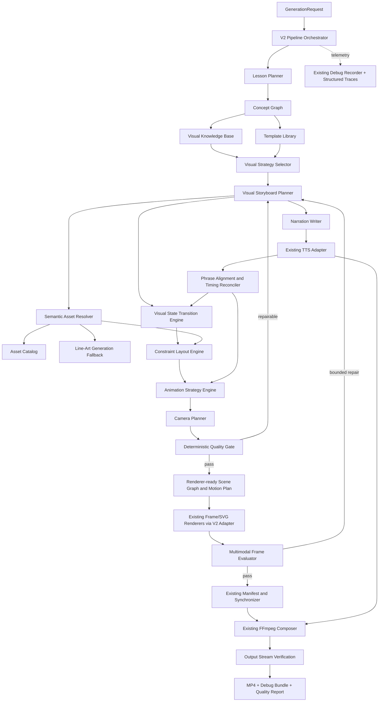
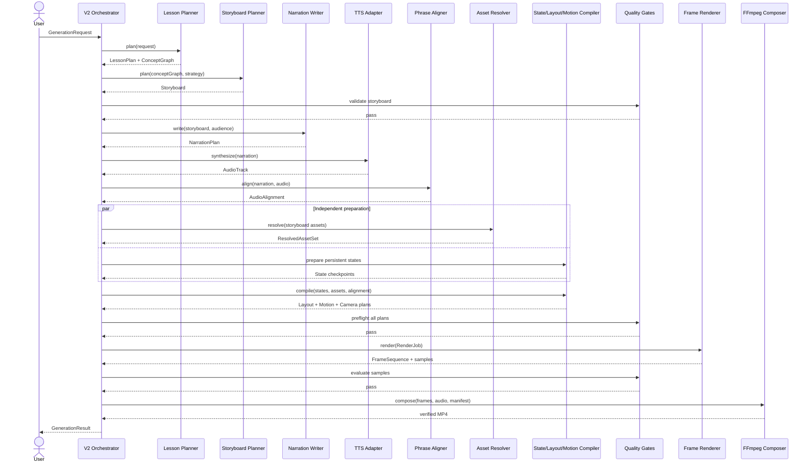
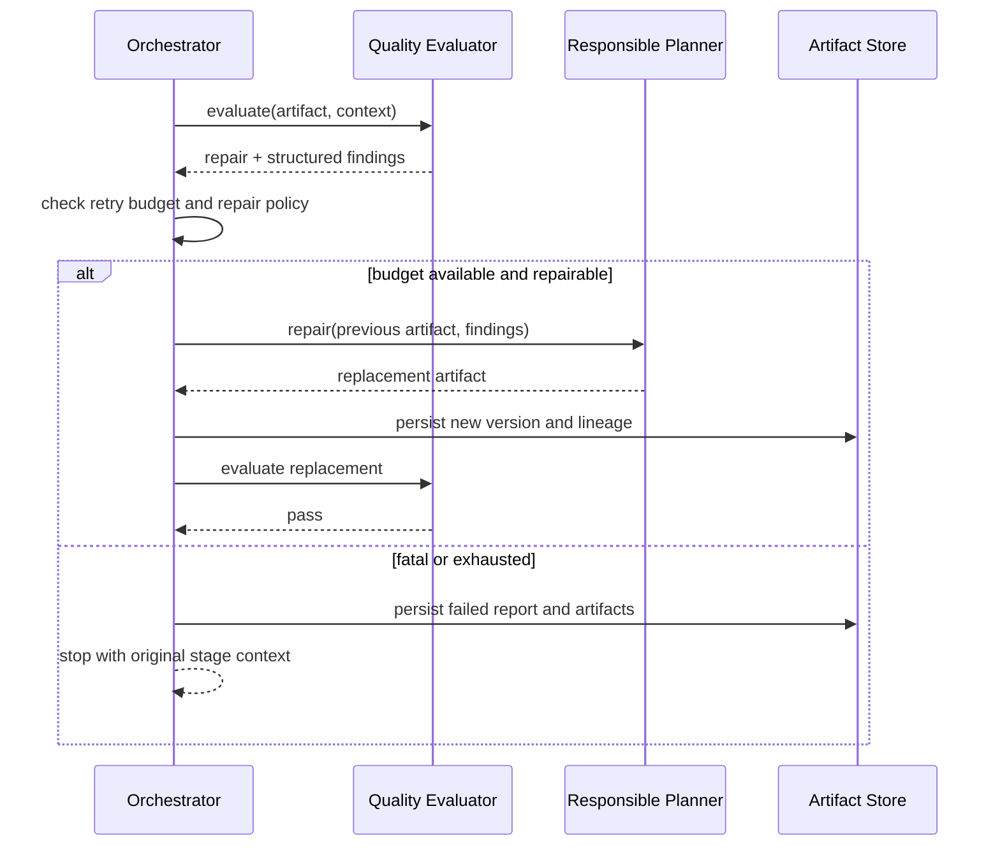
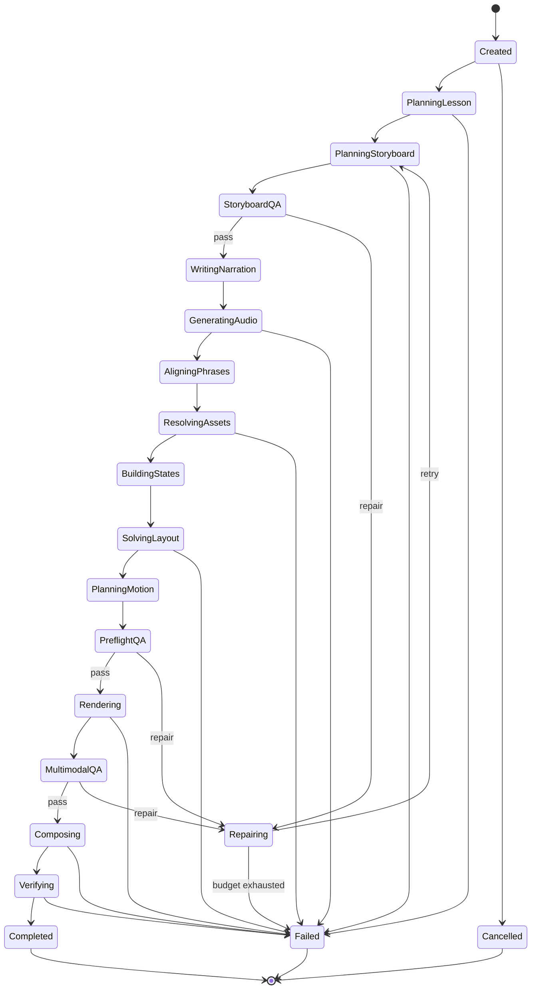
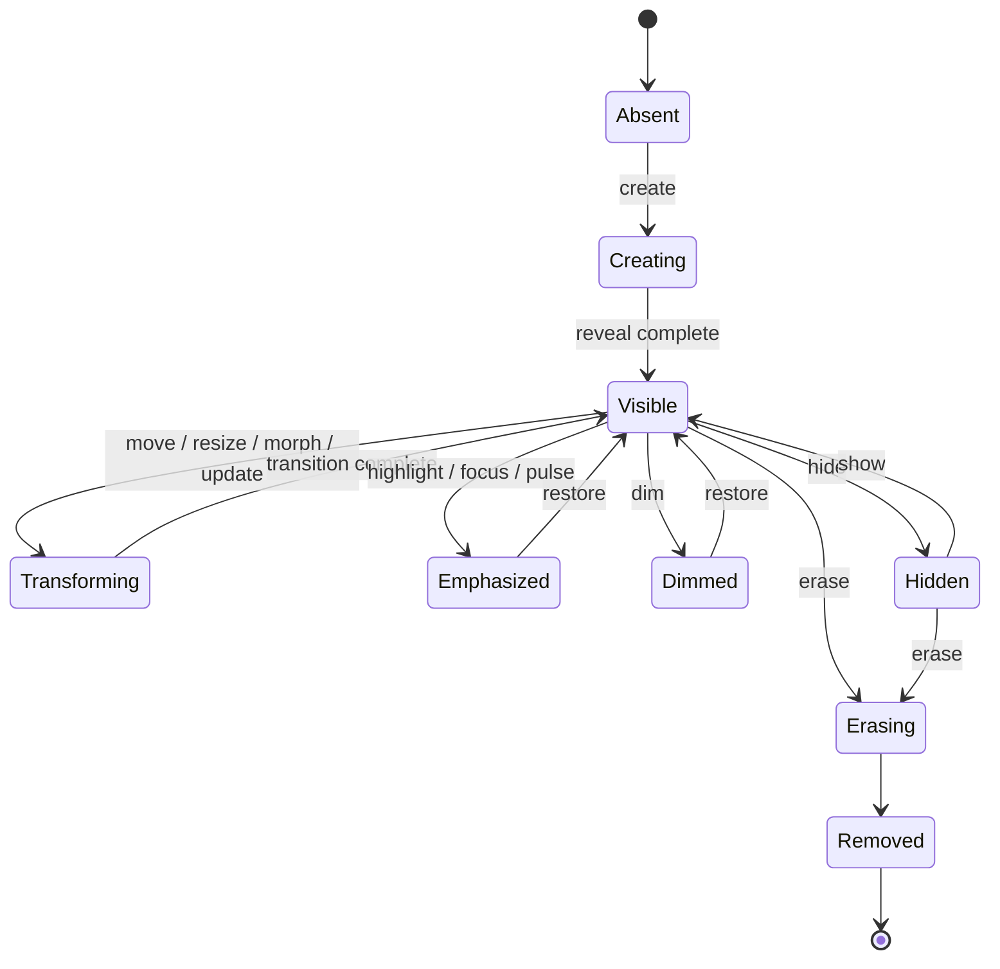

# Whiteboard AI Video Generator — V2 Architecture

Status: proposed  
Audience: architecture, AI, graphics, motion, platform, and QA engineers  
Scope: architecture and incremental migration; this document does not authorize a full rewrite  
Compatibility target: retain the current deterministic rendering and media pipeline while replacing the weak visual-planning contracts

## 1. Executive decision

V2 will be a semantic, storyboard-first video compiler.

The AI layer will decide what must be taught and how it should evolve visually. Deterministic services will decide layout, asset resolution, animation execution, frame generation, synchronization, and composition. The renderer will never infer educational meaning, and an LLM will never emit pixel coordinates.

The central change is a versioned intermediate representation (IR):

```text
Generation Request
      -> Lesson Plan + Concept Graph
      -> Visual Strategy + Storyboard
      -> Narration Phrases
      -> Phrase-aligned Visual Operations
      -> Persistent Visual Document States
      -> Constraint-based Layout
      -> Motion Plan + Camera Plan
      -> Renderer-ready Scene Graph
      -> Frames + Audio + MP4
```

The existing `AudioManager`, `TimelineSynchronizer`, `FrameRenderer`, `SVGRenderer`, `VideoComposer`, `VideoManifest`, `DebugRecorder`, and logging remain usable behind V2 ports and adapters. V1 remains available during migration.

## 2. Architectural principles

1. **Storyboard first:** narration is written against planned visual beats, not the reverse.
2. **Semantic before geometric:** AI produces concepts, relationships, operations, and constraints—not coordinates.
3. **Persistent identity:** every visual object has a stable ID across beats and scenes.
4. **State transitions, not slide replacement:** scenes are checkpoints in an evolving visual document.
5. **Deterministic execution:** validated IR, layout, scheduling, rendering, and composition are reproducible.
6. **Vector first:** templates, semantic primitives, and SVG assets are preferred; generated raster art is a fallback.
7. **Phrase-level timing:** visual events are attached to narration phrase IDs and reconciled with measured audio.
8. **Progressive disclosure:** diagrams are built, labeled, connected, and emphasized over time.
9. **Bounded AI:** each AI service has one typed responsibility, bounded retries, and no direct filesystem or renderer access.
10. **Quality gates:** invalid, visually empty, cognitively overloaded, or semantically weak plans do not reach final composition.
11. **Version every contract:** all persisted artifacts contain `schema_version`, producer metadata, and trace IDs.
12. **Replaceable subsystems:** orchestration depends on ports; providers and algorithms are plugins.

## 3. Target architecture diagram



### Control boundary

The orchestration layer owns retries, version compatibility, time budgets, cancellation, and artifact persistence. AI planners cannot invoke one another directly. They communicate only through validated artifacts managed by the orchestrator.

## 4. Proposed folder structure

The existing packages stay in place while V2 is introduced alongside them.

```text
app/
├── application/
│   ├── orchestrators/
│   │   ├── pipeline_v1.py
│   │   └── pipeline_v2.py
│   ├── ports/
│   │   ├── planning.py
│   │   ├── knowledge.py
│   │   ├── assets.py
│   │   ├── layout.py
│   │   ├── motion.py
│   │   ├── rendering.py
│   │   ├── audio.py
│   │   └── quality.py
│   └── use_cases/
│       └── generate_video.py
├── domain/
│   ├── generation.py
│   ├── lesson.py
│   ├── concept_graph.py
│   ├── storyboard.py
│   ├── visual_document.py
│   ├── operations.py
│   ├── layout.py
│   ├── motion.py
│   ├── camera.py
│   ├── assets.py
│   └── quality.py
├── agents/
│   ├── lesson_planner.py
│   ├── storyboard_planner.py
│   ├── narration_writer.py
│   ├── storyboard_critic.py
│   ├── visual_critic.py
│   └── prompts/
│       └── v2/
├── knowledge/
│   ├── visual_strategies.py
│   ├── repository.py
│   └── stores/
├── templates/
│   ├── registry.py
│   ├── contracts.py
│   └── builtins/
│       ├── algorithms/
│       ├── ai_ml/
│       ├── networking/
│       ├── databases/
│       └── system_design/
├── semantic_assets/
│   ├── catalog.py
│   ├── resolver.py
│   ├── licensing.py
│   └── providers/
│       ├── local_svg.py
│       ├── icon_catalog.py
│       └── generated_line_art.py
├── layout/
│   ├── engine.py
│   ├── constraints.py
│   ├── measurement.py
│   └── solvers/
│       ├── flow.py
│       ├── tree.py
│       ├── graph.py
│       ├── grid.py
│       └── general.py
├── motion/
│   ├── planner.py
│   ├── scheduler.py
│   ├── transitions.py
│   └── strategies/
├── camera/
│   ├── planner.py
│   └── viewport.py
├── quality/
│   ├── deterministic.py
│   ├── multimodal.py
│   ├── scoring.py
│   └── policy.py
├── infrastructure/
│   ├── llm/
│   ├── cache/
│   ├── persistence/
│   └── plugins/
├── adapters/
│   ├── legacy/
│   │   ├── script_to_storyboard.py
│   │   └── v2_to_render_scene.py
│   ├── audio/
│   │   └── edge_tts.py
│   ├── rendering/
│   │   ├── pillow_frames.py
│   │   └── svg.py
│   └── composition/
│       └── ffmpeg.py
├── observability/
│   ├── run_recorder.py
│   ├── artifact_manifest.py
│   └── metrics.py
├── core/                 # current V1 modules retained during migration
├── models/               # current V1 models retained during migration
├── renderers/            # current renderer implementations
└── services/             # current provider clients

assets/
├── catalog/
├── icons/
├── line_art/
├── styles/
└── fonts/

docs/
├── architecture-v2.md
├── adr/
├── schemas/
├── plugin-authoring.md
├── template-authoring.md
├── visual-style-guide.md
└── operations-runbook.md
```

## 5. Component responsibilities

| Component | Responsibility | Must not do |
|---|---|---|
| `LessonPlanner` | Create learning objectives, teaching order, prerequisites, and concept graph | Write narration, choose pixels, or render |
| `VisualKnowledgeBase` | Return known teaching strategies, preferred diagrams, complexity guidance, and prior quality evidence | Mutate plans or render |
| `TemplateLibrary` | Match concepts to parameterized educational diagrams | Call an LLM or assign timing |
| `StoryboardPlanner` | Create visual beats, persistent objects, operations, focus, and approximate pacing | Emit coordinates or synthesize audio |
| `NarrationWriter` | Write phrase-addressable narration that refers naturally to storyboard beats | Add unplanned concepts or control the renderer |
| `SpeechSynthesizer` | Generate audio and speech timing metadata | Change narration or visual meaning |
| `PhraseAligner` | Map phrase IDs to measured audio intervals | Rewrite content |
| `SemanticAssetResolver` | Resolve semantic objects through templates, local assets, or generated fallback | Decide educational meaning or layout |
| `VisualStateEngine` | Apply operations to persistent object state and create immutable checkpoints | Render frames |
| `LayoutEngine` | Solve constraints, measure content, avoid collisions, and fit viewports | Invent concepts or accept LLM coordinates |
| `AnimationPlanner` | Select semantic strategies and schedule operations across aligned phrases | Change the concept graph |
| `CameraPlanner` | Fit, pan, zoom, track, and focus without clipping | Modify educational content |
| `QualityEvaluator` | Score plans and sampled frames; produce actionable repair findings | Silently rewrite artifacts |
| `RenderEngine` | Deterministically render a validated layout and motion plan | Infer what an object means |
| `TimelineSynchronizer` | Convert measured audio intervals into continuous frame boundaries | Choose animation semantics |
| `VideoComposer` | Compose verified video/audio streams | Alter frames or narration |
| `PipelineOrchestrator` | Enforce ordering, policies, budgets, persistence, retries, and cancellation | Contain domain-specific planning logic |

## 6. Canonical data model

All IDs are stable strings scoped to a run. All times are seconds, monotonic, and local to the declared timeline unless marked global. All persisted models include `schema_version`.

### 6.1 Request and audience

```python
class GenerationRequest(BaseModel):
    schema_version: Literal["2.0"]
    run_id: str
    topic: str
    target_duration: float
    audience: AudienceProfile
    style_id: str
    language: str
    voice: str
    output: OutputProfile

class AudienceProfile(BaseModel):
    level: Literal["beginner", "intermediate", "advanced"]
    assumed_knowledge: list[str]
    learning_goal: str
    max_visual_density: int | None
```

### 6.2 Lesson and concept graph

```python
class ConceptNode(BaseModel):
    concept_id: str
    label: str
    definition: str
    importance: float
    prerequisites: list[str]
    teaching_order: int
    visual_affordances: list[str]

class ConceptEdge(BaseModel):
    edge_id: str
    source_id: str
    target_id: str
    relation: Literal[
        "depends_on", "part_of", "causes", "transforms_to",
        "contrasts_with", "example_of", "flows_to"
    ]
    label: str | None

class ConceptGraph(BaseModel):
    schema_version: Literal["2.0"]
    objectives: list[str]
    nodes: list[ConceptNode]
    edges: list[ConceptEdge]
    teaching_sequence: list[str]
```

### 6.3 Semantic visual document

`VisualObjectSpec` describes meaning and constraints before layout. Its `kind` is registry-backed, so new primitives can be installed without changing the core model.

```python
class VisualObjectSpec(BaseModel):
    object_id: str
    kind: str
    semantic_role: str
    concept_ids: list[str]
    content: dict[str, JsonValue]
    style_token: str
    asset_query: AssetQuery | None
    children: list[VisualObjectSpec]
    constraints: list[LayoutConstraint]
    accessibility_label: str

class VisualDocument(BaseModel):
    schema_version: Literal["2.0"]
    root: VisualObjectSpec
    object_index: dict[str, ObjectMetadata]
```

Initial built-in `kind` values include:

```text
text, label, annotation, callout, token_chip, equation, matrix, table,
array, linked_list, stack, queue, tree, graph, timeline, pipeline,
flowchart, decision_tree, histogram, probability_distribution,
coordinate_axes, connector, brace, bracket, highlight, underline,
component, nested_group, database, server, browser, phone, cloud,
cpu, gpu, memory, transformer_block, attention_matrix,
embedding_vector, neural_network, speech_bubble, semantic_asset
```

### 6.4 Storyboard and operations

```python
class VisualBeat(BaseModel):
    beat_id: str
    section_id: str
    concept_ids: list[str]
    teaching_intent: str
    phrase_intent: str
    estimated_duration: float
    operations: list[VisualOperation]
    attention: list[AttentionCue]
    camera_intent: CameraIntent | None

class Storyboard(BaseModel):
    schema_version: Literal["2.0"]
    document_id: str
    title: str
    beats: list[VisualBeat]
    initial_objects: list[VisualObjectSpec]
    final_learning_summary: list[str]

class VisualOperation(BaseModel):
    operation_id: str
    operation: Literal[
        "create", "update", "move", "resize", "highlight", "dim",
        "morph", "duplicate", "connect", "disconnect", "erase",
        "show", "hide", "group", "ungroup"
    ]
    target_ids: list[str]
    arguments: dict[str, JsonValue]
    reversible: bool
```

### 6.5 Phrase-addressable narration and alignment

```python
class NarrationPhrase(BaseModel):
    phrase_id: str
    beat_id: str
    text: str
    delivery: Literal["normal", "emphasis", "pause_before", "pause_after"]

class NarrationPlan(BaseModel):
    schema_version: Literal["2.0"]
    phrases: list[NarrationPhrase]

class PhraseTiming(BaseModel):
    phrase_id: str
    beat_id: str
    audio_start: float
    audio_end: float
    confidence: float

class AudioAlignment(BaseModel):
    schema_version: Literal["2.0"]
    audio_path: str
    duration: float
    phrases: list[PhraseTiming]
```

### 6.6 Layout, state, motion, and camera

```python
class LayoutConstraint(BaseModel):
    constraint_id: str
    type: Literal[
        "align", "distribute", "contain", "anchor", "connect",
        "avoid_overlap", "min_gap", "same_size", "aspect_ratio",
        "order", "near", "far_from"
    ]
    subject_ids: list[str]
    reference_id: str | None
    strength: Literal["required", "strong", "medium", "weak"]
    parameters: dict[str, JsonValue]

class LayoutBox(BaseModel):
    x: float
    y: float
    width: float
    height: float
    rotation: float = 0

class LaidOutNode(BaseModel):
    object_id: str
    box: LayoutBox
    z_index: int
    children: list[LaidOutNode]

class VisualState(BaseModel):
    state_id: str
    beat_id: str
    parent_state_id: str | None
    object_states: dict[str, ObjectState]

class MotionEvent(BaseModel):
    event_id: str
    operation_id: str
    object_ids: list[str]
    strategy: str
    start_time: float
    duration: float
    easing: str
    parameters: dict[str, JsonValue]

class CameraCue(BaseModel):
    cue_id: str
    start_time: float
    duration: float
    operation: Literal["fit", "pan", "zoom", "focus", "track", "hold"]
    target_ids: list[str]
    parameters: dict[str, float]
```

### 6.7 Assets and quality

```python
class AssetQuery(BaseModel):
    concept: str
    asset_kind: Literal["icon", "svg", "line_art", "template", "image"]
    style_id: str
    required_semantics: list[str]

class ResolvedSemanticAsset(BaseModel):
    asset_id: str
    query_digest: str
    source: Literal["template", "catalog", "generated", "legacy"]
    path: str
    mime_type: str
    license_id: str | None
    content_hash: str
    editable: bool
    ready: bool

class QualityFinding(BaseModel):
    code: str
    severity: Literal["info", "warning", "error", "fatal"]
    artifact_id: str
    message: str
    repair_target: str | None

class QualityReport(BaseModel):
    schema_version: Literal["2.0"]
    overall_score: float
    scores: dict[str, float]
    findings: list[QualityFinding]
    decision: Literal["pass", "repair", "fail"]
```

## 7. Representative JSON schemas

Schemas should be generated from Pydantic and committed under `docs/schemas/`. The fragments below define the stable contract, not prompt examples.

### 7.1 Concept graph schema

```json
{
  "$schema": "https://json-schema.org/draft/2020-12/schema",
  "$id": "whiteboard/concept-graph/2.0",
  "type": "object",
  "additionalProperties": false,
  "required": ["schema_version", "objectives", "nodes", "edges", "teaching_sequence"],
  "properties": {
    "schema_version": {"const": "2.0"},
    "objectives": {"type": "array", "items": {"type": "string", "minLength": 1}},
    "nodes": {
      "type": "array",
      "items": {
        "type": "object",
        "additionalProperties": false,
        "required": ["concept_id", "label", "definition", "importance", "prerequisites", "teaching_order", "visual_affordances"],
        "properties": {
          "concept_id": {"type": "string", "minLength": 1},
          "label": {"type": "string", "minLength": 1},
          "definition": {"type": "string", "minLength": 1},
          "importance": {"type": "number", "minimum": 0, "maximum": 1},
          "prerequisites": {"type": "array", "items": {"type": "string"}, "uniqueItems": true},
          "teaching_order": {"type": "integer", "minimum": 0},
          "visual_affordances": {"type": "array", "items": {"type": "string"}}
        }
      }
    },
    "edges": {"type": "array", "items": {"$ref": "#/$defs/edge"}},
    "teaching_sequence": {"type": "array", "items": {"type": "string"}, "uniqueItems": true}
  },
  "$defs": {
    "edge": {
      "type": "object",
      "additionalProperties": false,
      "required": ["edge_id", "source_id", "target_id", "relation"],
      "properties": {
        "edge_id": {"type": "string"},
        "source_id": {"type": "string"},
        "target_id": {"type": "string"},
        "relation": {"enum": ["depends_on", "part_of", "causes", "transforms_to", "contrasts_with", "example_of", "flows_to"]},
        "label": {"type": ["string", "null"]}
      }
    }
  }
}
```

### 7.2 Storyboard schema

```json
{
  "$schema": "https://json-schema.org/draft/2020-12/schema",
  "$id": "whiteboard/storyboard/2.0",
  "type": "object",
  "additionalProperties": false,
  "required": ["schema_version", "document_id", "title", "beats", "initial_objects"],
  "properties": {
    "schema_version": {"const": "2.0"},
    "document_id": {"type": "string", "minLength": 1},
    "title": {"type": "string", "minLength": 1},
    "initial_objects": {"type": "array", "items": {"$ref": "#/$defs/object"}},
    "beats": {
      "type": "array",
      "minItems": 1,
      "items": {
        "type": "object",
        "additionalProperties": false,
        "required": ["beat_id", "section_id", "concept_ids", "teaching_intent", "phrase_intent", "estimated_duration", "operations", "attention"],
        "properties": {
          "beat_id": {"type": "string"},
          "section_id": {"type": "string"},
          "concept_ids": {"type": "array", "items": {"type": "string"}, "minItems": 1},
          "teaching_intent": {"type": "string", "minLength": 1},
          "phrase_intent": {"type": "string", "minLength": 1},
          "estimated_duration": {"type": "number", "exclusiveMinimum": 0},
          "operations": {"type": "array", "items": {"$ref": "#/$defs/operation"}, "minItems": 1},
          "attention": {"type": "array", "items": {"type": "object"}},
          "camera_intent": {"type": ["object", "null"]}
        }
      }
    }
  },
  "$defs": {
    "object": {
      "type": "object",
      "additionalProperties": false,
      "required": ["object_id", "kind", "semantic_role", "concept_ids", "content", "style_token", "children", "constraints", "accessibility_label"],
      "properties": {
        "object_id": {"type": "string", "minLength": 1},
        "kind": {"type": "string", "minLength": 1},
        "semantic_role": {"type": "string", "minLength": 1},
        "concept_ids": {"type": "array", "items": {"type": "string"}},
        "content": {"type": "object"},
        "style_token": {"type": "string"},
        "asset_query": {"type": ["object", "null"]},
        "children": {"type": "array", "items": {"$ref": "#/$defs/object"}},
        "constraints": {"type": "array", "items": {"type": "object"}},
        "accessibility_label": {"type": "string", "minLength": 1}
      }
    },
    "operation": {
      "type": "object",
      "additionalProperties": false,
      "required": ["operation_id", "operation", "target_ids", "arguments", "reversible"],
      "properties": {
        "operation_id": {"type": "string"},
        "operation": {"enum": ["create", "update", "move", "resize", "highlight", "dim", "morph", "duplicate", "connect", "disconnect", "erase", "show", "hide", "group", "ungroup"]},
        "target_ids": {"type": "array", "items": {"type": "string"}, "minItems": 1},
        "arguments": {"type": "object"},
        "reversible": {"type": "boolean"}
      }
    }
  }
}
```

### 7.3 Quality report schema

```json
{
  "$schema": "https://json-schema.org/draft/2020-12/schema",
  "$id": "whiteboard/quality-report/2.0",
  "type": "object",
  "additionalProperties": false,
  "required": ["schema_version", "overall_score", "scores", "findings", "decision"],
  "properties": {
    "schema_version": {"const": "2.0"},
    "overall_score": {"type": "number", "minimum": 0, "maximum": 1},
    "scores": {
      "type": "object",
      "required": ["semantic_coverage", "alignment", "readability", "layout", "animation_density", "diagram_correctness"],
      "additionalProperties": {"type": "number", "minimum": 0, "maximum": 1}
    },
    "findings": {
      "type": "array",
      "items": {
        "type": "object",
        "additionalProperties": false,
        "required": ["code", "severity", "artifact_id", "message"],
        "properties": {
          "code": {"type": "string"},
          "severity": {"enum": ["info", "warning", "error", "fatal"]},
          "artifact_id": {"type": "string"},
          "message": {"type": "string"},
          "repair_target": {"type": ["string", "null"]}
        }
      }
    },
    "decision": {"enum": ["pass", "repair", "fail"]}
  }
}
```

## 8. Pipeline redesign

1. **Validate request.** Normalize audience, duration, style, language, and output constraints.
2. **Plan lesson.** Produce objectives and a concept graph with teaching order and dependencies.
3. **Select visual strategy.** Query the knowledge base and template registry; decide which concepts need templates, primitive compositions, or external assets.
4. **Build storyboard.** Create persistent objects and visual operations organized into educational beats. Estimate density and pacing.
5. **Run storyboard preflight.** Reject unsupported object kinds, dangling IDs, missing labels, cyclic invalid operations, or excessive density.
6. **Write narration from storyboard.** Produce one or more phrases per beat, each carrying stable `phrase_id` and `beat_id` values.
7. **Generate speech.** Reuse the current TTS system through an adapter. Record word/phrase events when supported; otherwise perform deterministic phrase alignment against the generated audio.
8. **Reconcile timing.** Replace estimated beat times with measured phrase intervals. Preserve ordering and minimum animation durations.
9. **Resolve semantic assets.** Prefer templates, then licensed local SVG/icon assets, then bounded line-art generation. Fail preflight when a required asset remains a placeholder.
10. **Apply state transitions.** Materialize immutable visual states from operations while preserving object identity.
11. **Solve layout.** Measure text and assets, expand hierarchical components, solve constraints, avoid collisions, and fit the viewport.
12. **Plan motion and attention.** Select semantic animation strategies, distribute events over phrase intervals, and create camera cues.
13. **Run deterministic quality checks.** Validate geometry, timing, coverage, labels, density, state integrity, and asset readiness.
14. **Repair when allowed.** Route only the failed artifact and structured findings to the responsible planner. Maximum retry counts are policy-controlled.
15. **Compile renderer IR.** Convert hierarchy and motion into renderer-specific draw commands and layer snapshots.
16. **Render frames.** Reuse current renderers initially through an adapter; add semantic renderers incrementally.
17. **Sample and evaluate frames.** Use deterministic image checks first, then a multimodal evaluator for semantic alignment and diagram correctness.
18. **Compose and verify.** Reuse manifest synchronization and FFmpeg composition. Verify stream count, duration, dimensions, frame count, and codecs.
19. **Publish artifacts.** Write the MP4, quality report, schema-versioned debug bundle, stage timings, and provenance manifest.

## 9. Agent architecture

These are specialized inference components, not unconstrained autonomous agents.

| Agent | Input | Output | Repair scope |
|---|---|---|---|
| Lesson Planner | Request + curriculum policy | Lesson plan + concept graph | Concept ordering and coverage |
| Storyboard Planner | Concept graph + visual strategies + templates | Storyboard + semantic objects + operations | Visual beats and object operations |
| Narration Writer | Accepted storyboard + audience | Phrase-addressable narration | Wording, pacing, and references to visuals |
| Storyboard Critic | Concept graph + storyboard + policy | Quality findings | Requests targeted storyboard repair |
| Visual Critic | Narration, states, and sampled frames | Multimodal quality findings | Requests targeted layout, asset, or storyboard repair |

Agent rules:

- Inputs and outputs are strict Pydantic/JSON Schema contracts.
- No agent writes files, assigns coordinates, calls TTS, or invokes renderers.
- Prompts are versioned and recorded without credentials.
- Provider name, model, prompt version, schema version, latency, token usage, and retry reason are recorded.
- Repair prompts contain the previous artifact and machine-readable findings; they do not restart the entire pipeline.
- Each agent has a maximum call count and deadline.
- Deterministic validation always precedes AI criticism.

## 10. Sequence diagrams

### 10.1 Successful generation



### 10.2 Bounded quality repair



## 11. State machines

### 11.1 Pipeline run state



### 11.2 Persistent object lifecycle



Object invariants:

- `create` is the only transition from absent to present.
- Operations may target only existing objects unless the operation creates them.
- IDs are never reused within a run.
- Removed objects remain in provenance history.
- A state checkpoint is immutable; transitions produce a new checkpoint.
- Parent removal requires explicit cascade or reparenting behavior.

## 12. Programmatic API interfaces

These are internal Python ports, not FastAPI routes.

```python
class LessonPlanner(Protocol):
    def plan(self, request: GenerationRequest) -> LessonPlan: ...

class VisualKnowledgeBase(Protocol):
    def strategies_for(
        self, graph: ConceptGraph, audience: AudienceProfile
    ) -> list[VisualStrategy]: ...

class TemplateLibrary(Protocol):
    def match(self, graph: ConceptGraph) -> list[TemplateMatch]: ...
    def instantiate(
        self, template_id: str, parameters: dict[str, JsonValue]
    ) -> VisualObjectSpec: ...

class StoryboardPlanner(Protocol):
    def plan(
        self,
        lesson: LessonPlan,
        strategies: list[VisualStrategy],
        templates: list[TemplateMatch],
    ) -> Storyboard: ...

class NarrationWriter(Protocol):
    def write(
        self, storyboard: Storyboard, audience: AudienceProfile
    ) -> NarrationPlan: ...

class SpeechSynthesizer(Protocol):
    def synthesize(
        self, narration: NarrationPlan, voice: str
    ) -> AudioTrack: ...

class PhraseAligner(Protocol):
    def align(
        self, narration: NarrationPlan, audio: AudioTrack
    ) -> AudioAlignment: ...

class SemanticAssetResolver(Protocol):
    def resolve(self, storyboard: Storyboard) -> ResolvedAssetSet: ...

class VisualStateEngine(Protocol):
    def materialize(self, storyboard: Storyboard) -> list[VisualState]: ...

class LayoutEngine(Protocol):
    def layout(
        self,
        states: list[VisualState],
        assets: ResolvedAssetSet,
        viewport: Viewport,
    ) -> LayoutPlan: ...

class AnimationPlanner(Protocol):
    def plan(
        self,
        storyboard: Storyboard,
        layout: LayoutPlan,
        alignment: AudioAlignment,
    ) -> MotionPlan: ...

class CameraPlanner(Protocol):
    def plan(
        self, layout: LayoutPlan, motion: MotionPlan
    ) -> CameraPlan: ...

class QualityEvaluator(Protocol):
    def evaluate(self, request: EvaluationRequest) -> QualityReport: ...

class RenderEngine(Protocol):
    def render(self, job: RenderJob) -> FrameSequence: ...

class VideoComposer(Protocol):
    def compose(self, job: CompositionJob) -> VideoArtifact: ...
```

Plugin discovery should use explicit configuration and a registry. A plugin declares its name, semantic version, supported contract versions, capabilities, and configuration schema. Runtime imports must never be selected from untrusted user input.

## 13. Layout and visual language design

### Hierarchy

A visual document is a tree with cross-node connectors. Containers own children; connectors reference stable IDs. Layout proceeds bottom-up for measurement and top-down for placement.

Example:

```text
TransformerBlock_001
├── AttentionGroup_001
│   ├── Q_Matrix_001
│   ├── K_Matrix_001
│   ├── V_Matrix_001
│   └── AttentionConnector_001
├── ResidualConnector_001
├── LayerNorm_001
└── FeedForward_001
```

### Solver pipeline

1. Validate object and constraint references.
2. Resolve assets and intrinsic sizes.
3. Measure text using the actual render font.
4. Expand semantic templates into layout nodes.
5. Select specialized solvers for arrays, trees, graphs, grids, timelines, and pipelines.
6. Solve required constraints.
7. Optimize strong/medium/weak preferences.
8. Detect collisions and edge crossings.
9. Apply viewport fit and safe margins.
10. Produce a deterministic layout digest and diagnostics.

The general solver may use a constraint library later, but specialized deterministic algorithms should handle common educational structures first. This reduces complexity and improves visual consistency.

### Style system

Objects use semantic style tokens such as `concept.primary`, `data.input`, `process.active`, `warning`, and `annotation`. A style resolver maps tokens to stroke, fill, font, line width, corner radius, and hand-drawn treatment. Storyboards never specify raw colors unless a template parameter explicitly permits it.

## 14. Animation, attention, and camera strategy

Animation strategies are registered by semantic kind:

| Kind | Default strategy |
|---|---|
| Text/equation | Handwriting or left-to-right write |
| Array | Outline, then reveal cells, values, pointer, and highlight |
| Linked list | Reveal nodes, then grow links |
| Tree | Expand parent-to-child by depth |
| Graph | Reveal nodes, then grow semantically ordered edges |
| Pipeline | Reveal stages, then animate flow along connectors |
| Matrix | Draw grid, write labels, then highlight relevant cells |
| Probability distribution | Draw axes, grow bars/curve, highlight selected outcome |
| Transformer block | Reveal subcomponents, connections, then pulse active path |
| Semantic asset | Stroke reveal or fade based on editability |

Scheduling rules:

- Each phrase owns a visual event window.
- Important nouns introduce or focus objects; verbs trigger operations; contrasts dim previous state and emphasize the new state.
- No unexplained object may appear before its concept is introduced.
- A configurable maximum static gap applies per audience profile.
- Simultaneous events are allowed only when they form one understandable group.
- Motion duration is clamped to the phrase interval with readability minimums.
- The final state receives a short hold before a major transition.

Camera rules:

- Default to `fit-to-content` with safe margins.
- Pan/zoom only when content cannot remain readable in a stable wide view.
- Camera motion must not overlap dense object motion unless explicitly allowed.
- Focus cues should keep the active concept within the central safe region.
- Camera state is deterministic and included in frame debugging.

## 15. Quality system

### Deterministic checks

- Referential integrity for concepts, beats, phrases, objects, assets, and operations.
- No unresolved required assets or production placeholders.
- No empty semantic containers unless a later beat fills them.
- All connectors have valid endpoints and optional required labels.
- No forbidden overlap, clipping, or text below minimum readable size.
- Continuous audio, phrase, scene, motion, camera, and frame intervals.
- No operation outside its phrase window.
- No excessive static gap or animation overload.
- Object lifecycle and hierarchy invariants hold.
- Complexity is within the audience-specific density budget.
- Every high-importance concept has at least one visual representation.

### AI and multimodal checks

- Narration-to-visual semantic coverage.
- Diagram correctness and directionality.
- Whether visual emphasis matches the spoken phrase.
- Missing labels or misleading assets.
- Cognitive load and progressive disclosure quality.
- Final summary consistency with learning objectives.

### Recommended initial policy

| Metric | Initial gate |
|---|---|
| Required asset readiness | 100% |
| Placeholder count | 0 |
| Dangling object/connector references | 0 |
| High-importance concept visual coverage | at least 0.90 |
| Forbidden overlap/clipping | 0 |
| Maximum unexplained static gap | audience-configurable, default 3 seconds |
| Minimum text readability | style/profile controlled |
| Repair attempts | maximum 2 per artifact type |

Scores are signals, not truth. Multimodal evaluation must be calibrated against a human-reviewed benchmark and must never be the sole validator for mathematical or technical correctness.

## 16. Backward compatibility strategy

1. Keep all V1 models and current public methods unchanged during migration.
2. Add `PIPELINE_VERSION=v1|v2`, defaulting to V1 until V2 reaches acceptance criteria.
3. Keep `PipelineRunner.run(topic, output_dir)` and its returned output path stable through a facade.
4. Add a `LegacyScriptToStoryboardAdapter` that maps V1 scenes to V2 beats. It preserves current behavior but marks artifacts as `source=legacy`.
5. Add a `V2RenderPlanToLegacyAdapter` that flattens supported V2 hierarchy into current `RenderScene` and `AnimationTimeline` contracts during early phases.
6. Reuse current `AudioMetadata`, `VideoManifest`, frame naming, output location, and FFmpeg behavior initially.
7. Version debug artifacts under `pipeline/v1/` and `pipeline/v2/`; include an artifact manifest with hashes and lineage.
8. Maintain V1 golden videos and test fixtures. Every preservation change must show no unintended V1 frame/audio regression.
9. Unsupported V2 objects fail preflight or use an explicit semantic fallback; they must not silently become empty boxes.
10. Deprecate V1 only after V2 passes functional, visual-quality, performance, and operational gates for representative topics.

## 17. Migration plan and implementation phases

### Phase 0 — Baseline and decisions

- Freeze representative V1 debug bundles and golden outputs.
- Record architecture decisions for IDs, schema versioning, time units, plugin loading, style tokens, and artifact persistence.
- Add performance and quality baselines.
- Exit: current tests and golden fixtures are reproducible.

### Phase 1 — V2 contracts and ports, no behavior change

- Introduce domain models, protocols, schema generation, artifact envelopes, and the pipeline facade.
- Wrap existing TTS, synchronization, renderer, composer, and debug recorder as adapters.
- Exit: V1 still produces identical output through the facade.

### Phase 2 — Split planning responsibilities

- Add Lesson Planner, Storyboard Planner, and Narration Writer with typed contracts.
- Add deterministic referential and schema validation.
- Use the legacy render adapter.
- Exit: narration is phrase-addressable and all artifacts validate.

### Phase 3 — Concept graph and persistent storyboard

- Add concept graph validation, stable object IDs, visual operations, immutable visual states, and scene memory.
- Implement create/update/highlight/dim/show/hide/erase before complex morphing.
- Exit: at least one object persists and changes across multiple beats in integration fixtures.

### Phase 4 — Semantic templates and primitive renderers

- Implement the template registry and a small high-value template set: pipeline, array, tree, graph, matrix, probability distribution, transformer block.
- Add semantic renderer plugins incrementally.
- Exit: reference topics render labeled educational diagrams without generic empty primitives.

### Phase 5 — Constraint layout engine

- Add text measurement, hierarchy layout, specialized solvers, collision detection, connector routing, and fit-to-content.
- Exit: deterministic layout fixtures pass across supported canvas sizes and content lengths.

### Phase 6 — Phrase alignment and semantic animation

- Capture or derive phrase timing, retime beats, add strategy registry, progressive disclosure, attention cues, and camera fit/focus.
- Exit: visual events cover the narration timeline within configured static-gap limits.

### Phase 7 — Semantic asset system

- Add catalog metadata, licensing, content-addressed cache, icon/SVG providers, and generated line-art fallback.
- Exit: production rendering rejects unresolved placeholders; fallback output is style-consistent and cached.

### Phase 8 — Quality and repair loop

- Add deterministic scoring, storyboard critic, frame sampling, multimodal critic, bounded repair, and lineage tracking.
- Exit: known-bad fixtures are rejected and repair convergence is measurable.

### Phase 9 — Knowledge base and template expansion

- Add evidence-backed visual strategies and templates for algorithms, AI/ML, networking, databases, operating systems, authentication, blockchain, and system design.
- Exit: template coverage and human quality scores meet product targets for the selected domain set.

### Phase 10 — Production hardening

- Add persistent job state, cancellation, resumability, concurrency limits, artifact retention, cache eviction, cost budgets, security review, and operational dashboards.
- Exit: reliability, latency, cost, and recovery service-level objectives are met.

## 18. Step-by-step implementation roadmap

1. Approve this architecture and create ADRs for the unresolved decisions.
2. Select 10–20 representative topics and audience levels for the benchmark suite.
3. Freeze V1 outputs and current test results.
4. Define artifact envelopes and generate Pydantic JSON Schemas.
5. Add the V1/V2 pipeline facade and feature flag.
6. Wrap existing media components behind ports without changing their internals.
7. Implement concept graph models and validators.
8. Implement storyboard, persistent object, operation, phrase, layout, motion, camera, and quality models.
9. Add agent adapters with mocked contract tests before any live model calls.
10. Split lesson, storyboard, and narration inference.
11. Implement visual-state materialization and lifecycle validation.
12. Implement the template registry and the first semantic templates.
13. Implement text measurement and specialized layouts for pipeline, grid, tree, and graph.
14. Build the V2-to-existing-renderer adapter.
15. Add phrase timing and timing reconciliation.
16. Add semantic animation strategies and distribute them across the full audio duration.
17. Add attention and initial fit/focus camera cues.
18. Add the semantic asset catalog and generated line-art fallback.
19. Add deterministic quality gates and quality reports.
20. Add sampled-frame multimodal evaluation with bounded targeted repair.
21. Run benchmark comparisons against V1 and human storyboards.
22. Optimize caches, layout reuse, rendering, and composition.
23. Enable V2 for an internal canary cohort while retaining instant V1 rollback.
24. Expand templates based on quality evidence, not raw topic count.
25. Promote V2 to default only after acceptance gates are met.

## 19. Testing strategy

### Unit and contract tests

- Pydantic validation and JSON round-trip tests for every artifact.
- Schema compatibility tests for minor versions.
- ID uniqueness, reference integrity, state lifecycle, timing, and hierarchy invariants.
- Plugin capability and contract conformance suites.
- Layout measurement, solver, connector routing, and collision tests.
- Animation strategy tests for each semantic kind.

### Property-based tests

- Random valid visual trees never produce negative sizes or off-canvas required content.
- Applying valid operations yields valid immutable states.
- Frame and audio ranges remain continuous after timing reconciliation.
- Layout is deterministic for identical inputs and configuration.

### Golden and visual regression tests

- Golden JSON artifacts for concept graphs, storyboards, states, layouts, and motion plans.
- Golden SVG/PNG snapshots for templates and semantic renderers.
- Perceptual-difference thresholds with explicit review for approved changes.
- Font, wrapping, clipping, alpha, and camera viewport fixtures.

### AI evaluation tests

- Fixed benchmark topics across beginner/intermediate/advanced profiles.
- Mocked inference for CI; scheduled live-provider evaluation outside normal unit tests.
- Human-reviewed reference scores for coverage, correctness, pacing, and cognitive load.
- Critic calibration tests for false positives and false negatives.
- Adversarial topics, ambiguous requests, and prompt-injection-like topic text.

### Integration and end-to-end tests

- Complete mocked run through all V2 ports.
- Real local rendering and FFmpeg composition with fixture audio.
- TTS/provider failure, asset miss, layout infeasibility, critic rejection, retry exhaustion, cancellation, and resume tests.
- V1 compatibility tests and output-path/API stability.
- Debug bundle completeness and secret-exclusion tests.

### Acceptance tests

- No placeholders or empty unlabeled primitives.
- Phrase-to-visual event coverage meets policy.
- Representative diagrams are technically correct.
- Persistent objects survive transitions correctly.
- Audio/video duration stays within one frame or the established tolerance.
- Human reviewers prefer V2 over V1 by the agreed margin on the benchmark set.

## 20. Performance and scalability

- Cache AI artifacts by normalized input, model, prompt version, schema version, and strategy digest.
- Cache resolved assets and generated line art by content hash and style ID.
- Cache template expansion, text measurements, and stable layout subtrees.
- Resolve independent assets concurrently under bounded worker limits.
- Use incremental layout for unchanged persistent subtrees.
- Reuse rendered layers and update only dirty objects when producing frames.
- Preserve PNG frames for debugging initially; later allow streaming raw frames to FFmpeg while retaining sampled PNGs and deterministic manifests.
- Bound LLM and critic retries, tokens, wall time, and generated-asset counts per run.
- Persist stage checkpoints so failed or interrupted runs resume from the last compatible artifact.
- Track p50/p95 latency, cost per minute of output, cache hit rate, frames per second, repair rate, and failure rate by stage.
- Use content-addressed artifacts to avoid copying identical SVGs and generated images.
- Keep layout and rendering deterministic across workers by pinning fonts, renderer versions, styles, and random seeds.

## 21. Risk analysis

| Risk | Impact | Mitigation |
|---|---|---|
| LLM produces valid but educationally weak plans | High | Concept coverage gates, templates, critic, human benchmark |
| LLM emits unsupported kinds or dangling IDs | High | Registry-constrained schema, deterministic preflight, targeted repair |
| Layout becomes infeasible for dense scenes | High | Density planner, specialized solvers, pagination/camera strategy, clear failure diagnostics |
| Diagram is visually attractive but technically wrong | High | Domain templates, deterministic validators, calibrated multimodal and human evaluation |
| Generated assets are inconsistent or misleading | High | Vector-first policy, style-locked generation, cache, semantic verification |
| Licensing or provenance is unknown | High | Asset catalog license metadata, allowlist, provenance manifest |
| Too much motion harms learning | Medium | Audience-aware density, attention policy, motion budget, human testing |
| Multimodal critic is inconsistent | Medium | Deterministic checks first, calibrated thresholds, bounded authority |
| More AI stages increase latency and cost | High | Caching, small-model routing, bounded repair, templates, parallel independent work |
| Plugin ecosystem introduces unsafe code | High | Explicit allowlist, signed/package-reviewed plugins, capability declarations, no user-controlled imports |
| Schema evolution breaks saved runs | High | Versioned contracts, migrators, compatibility tests, immutable historical artifacts |
| V2 regresses working media synchronization | High | Adapter boundary, V1 golden tests, frame/audio invariants, feature-flag rollback |
| Knowledge base accumulates poor strategies | Medium | Evidence scores, review workflow, versioning, rollback, provenance |
| Fonts or rendering differ across machines | Medium | Bundled fonts, pinned dependencies, renderer fingerprint in artifacts |
| Topic text attempts prompt injection | High | Treat topic as data, structured messages, output schemas, no tool authority for agents |

## 22. Documentation set

Before V2 becomes the default, the repository should contain:

- Architecture overview and component map.
- ADRs for pipeline ordering, contract versioning, IDs, timing, plugin loading, layout solver, and quality policy.
- Generated JSON Schema reference.
- Visual language and style-token guide.
- Semantic primitive authoring guide.
- Template authoring, validation, and review guide.
- Plugin capability and compatibility guide.
- Asset sourcing, licensing, provenance, and cache policy.
- Prompt/agent contract guide with repair behavior.
- Quality metric definitions and evaluator calibration process.
- Debug bundle and artifact lineage reference.
- Operations runbook for failed, retried, cancelled, and resumed jobs.
- V1-to-V2 migration and rollback guide.
- Benchmark suite and human-review rubric.

The README and handoff now describe the implemented V2 compiler, executable
templates, authoritative camera planning, streamed renderer, quality gates,
and optional install profiles. Keep them synchronized with contract changes.

## 23. Debugging and observability contract

Each run should persist an artifact manifest containing:

- Run ID, request digest, pipeline version, status, and timestamps.
- Every stage input/output path, schema version, content hash, producer, and parent artifact IDs.
- AI provider/model/prompt versions, latency, token usage, retries, and redacted error data.
- Concept graph, strategy selection, template matches, storyboard versions, repair findings, and final accepted artifact.
- Narration phrases, audio timing, alignment confidence, and timing reconciliation changes.
- Asset queries, match scores, source, license, hash, and readiness.
- State transitions, layout constraints, solver diagnostics, motion events, and camera cues.
- Frame traces, representative samples, quality scores, and multimodal findings.
- FFmpeg command, verified streams, output hash, and final status.

The run status must have one authoritative source and be atomically finalized so a completed `result.json` cannot coexist with a stale `run.json` status.

## 24. Architecture acceptance criteria

The design is successfully implemented when:

1. Visual meaning exists in typed artifacts before rendering.
2. The renderer receives no responsibility for educational inference.
3. LLM output contains no pixel coordinates.
4. Storyboards contain stable object IDs and valid state operations.
5. Narration phrases reference storyboard beats and align to measured audio.
6. Layout is deterministic, hierarchical, collision-aware, and viewport-safe.
7. Animation strategies depend on semantic object kinds and span the narration.
8. Templates render professional labeled diagrams for the initial benchmark domains.
9. Required assets resolve without production placeholders.
10. Quality gates reject known-bad visual plans and sampled renders.
11. Current media synchronization and composition remain verified.
12. V1 remains available until V2 meets agreed quality, reliability, latency, and cost targets.

## 25. Decisions still requiring approval

- Initial benchmark topics and human-review rubric.
- First semantic primitive and template set.
- Constraint solver implementation or dependency.
- Phrase-timing source when TTS speech marks are incomplete.
- Allowed asset catalogs and licensing policy.
- Generated line-art provider and data-retention policy.
- Multimodal evaluator provider, thresholds, and repair authority.
- Persistence backend for resumable production jobs.
- Target quality, latency, and cost service-level objectives.

These decisions should be captured as ADRs before their implementation phases begin.
